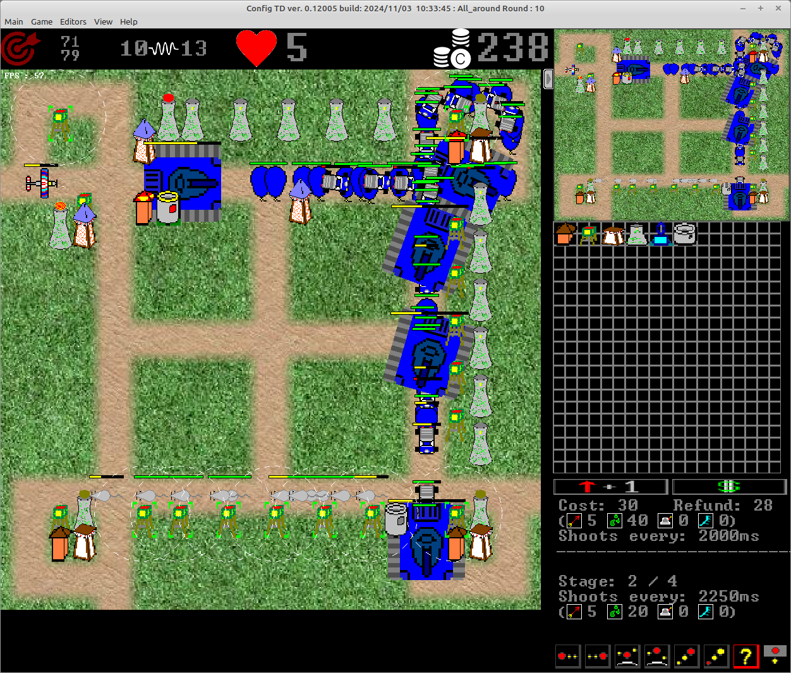
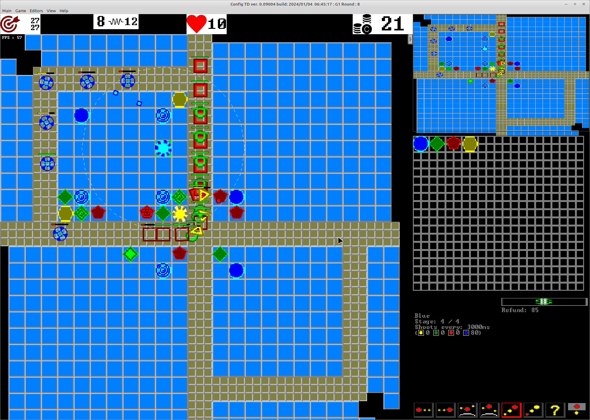
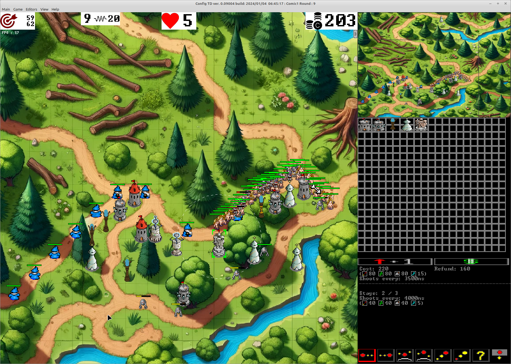
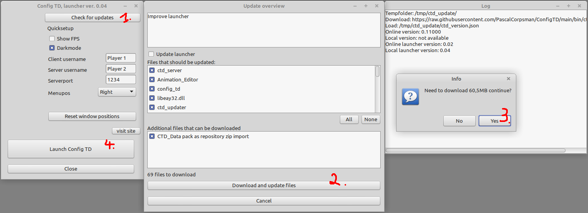

# Config Tower Defense (Config TD)

Config TD is an opensource and free Tower Defense clone with the aim of maximal configurabillity and as easy as possible map creation for single and multiplayer matches.

It supports multiple graphical themes and is client server based. 

The game follows the genre typical mechanics and consists of buildings that can be bought, opponents (often called "creeps") and even hero's (like buildings but moveable).  
Creeps are send in waves. The player has to defeat them all, if not the player looses one life per creep. The match is finished on one of two choises

* the player lost all lifes -> player loose
* the player defeated all waves -> player wins

If not in playing mode the game is always in editor mode, so the game is editor and game in one program. Maps can be played during creation which makes map creation the same fun as playing the maps.

#### Preview theme Classic Pixelart

#### Preview theme colored

#### Preview theme comic

### Features
- 1 to 16 player (theoretically there is no limitiation to the player count, but in reallity the game does not support more than 65535 enemies at the map, which gives an upper limit for the playercount) (also the bandwidth which is used and the rendering performance of the computer could limit the game)
- client-server based (server runs in console mode, so dedicated server is possible)
- multiplatform Windows / Linux (matches can mix OS types)
- LAN and WAN playable (for WAN mode you need a port forwarding to the server)
- load / save of game, even in multiplayer mode (including automated bakups after each completed wave)
- pause / timewarp (speedup x2, x4)
- ingame chat
- game statistics (at the end of a match in detail, during the game only kills and money )
- hinting system (CTRL + left mouse button gives a "!" that everyone can see)
- 2 orthogonal gaming modes (Coop vs. Head to Head / Mazing vs. defeating) => 4 game variants
- 3 choosable difficulty levels
- 4 damage classes (typically labeled as Stich, Poison, Magic, Air)
- 2 kinds of opponent movements (Floor- / Airunits)
- all settings of the map / game can be edited at the same time by all player, there is no game leader. This allows multiple players to define the map and waves at the same time during gameplay
- players can donate money between each others during gameplay
- each unit / building / hero is complete free configurable, this also includes the availibility of buyable objects in the match
- multiple themes all free mixable, ingame map, texture, building, opponent and hero editor
- map creation during gaming (maps can be created wave by wave while playing them, even repeating of the last wave is possible)
  * map layer can be imported by image or created within the ingame editor
  * arbiture number of waves, with arbiture amount of opponents (max 65535 per wave)
  * wave generator for automated wave creation
- arbiture opponent classes
  * boss (only tags)
  * bonus (does not decrease lifepoints when reaching the end of the track)
- arbiture amount of buildings, each building can have as many update levels as defined
  * bank (earn money on hit and destroy opponent)
  * siege vs. shooting (building can place bullets around its location or shoot at opponents)
  * slowing (dynamic or static)
  * splash (bullets can hit multiple opponents)
  * free choosable damage classes
  * supports multiple attack strategies
    * first / last / weakest / stronges / nearest / farest / random
    * prever air over floor / prever floor over air
- heros (more or less same as buildings, but can be moved free on the map)  

## What needs to be done to play the game

1. Download the [ctd_launcher.exe](https://raw.githubusercontent.com/PascalCorpsman/ConfigTD/main/bin/ctd_launcher.exe) for windows users or the [ctd_launcher](https://raw.githubusercontent.com/PascalCorpsman/ConfigTD/main/bin/ctd_launcher) binary for linux 64 users.  
   - Linux users may need to make the binary executable (chmod +x)
   - [Optional] some Linux need to add the following packages:
       - SSL-Driver
         > sudo aptitude install libssl-dev
       - OpenGL driver
         > sudo apt-get install freeglut3-dev

2. Run the launcher 
   
   (1) press "Check for updates" 
   (2) press "Download and update files" 
   (3) confirm "yes" to download and wait until the window closes 
   (4) press "Launch Config TD" and enjoy

3. Read the [manual](https://github.com/PascalCorpsman/ConfigTD/tree/main/documentation/Readme.md) as needed

## Why is there no sound ?

Actual the game is (at least at the moment) not designed to use sounds. This is due to the following reasons:
- adds lots of complexity
- disturbes when played with thousands of units on the map
- game is designed for LAN-Parties, where everyone talks to each other, all the sound effects will then mess up the room sound and typically are switched of anyway

It could be possible that in future these arguments change and sound support will be added.

## I want to contribute what is needed ?

#### Found a bug:
- Check for the newest version (using the ctd_launcher)
- if the bug still exists create a ticket in this repository
  - describe all needed to reprocude, this includes at least:
    - OS-Version
    - all steps to reproduce the bug

#### Want to add content:

- please have a look at the [Config TD Data](https://github.com/PascalCorpsman/ConfigTD_Data) repository
- The project always needs
  - more units
  - more buildings
  - more maps
  - more graphics
  - more tutorials

## What needs to be done to compile the game

To be able to compile the code you need the [Lazarus-IDE](https://www.lazarus-ide.org)

Inside Lazarus you need to install the following packages:
- L-Net from [here](https://github.com/almindor/lnet) ~~or use the online Packagemanager to install~~(OPM version seems to be outdated and not working)
- LazOpenGLContext (comes with lazarus, install via "Package" -> "Install Packages")
- TaChartLazarusPkg (comes with lazarus, install via "Package" -> "Install Packages")
- UniqueInstance (comes from the lazarus online package manager)
- MetaDarkStyle (comes from the lazarus online package manager)
- TurboPowerIPro (comes with lazarus, install via "Package" -> "Install Packages")

Additional you need to download and copy the files from [DGLOpenGL](https://github.com/saschawillems/dglopengl) and [Synapse](http://www.ararat.cz/synapse/doku.php/download) 
into a searchpath (e.g. units/)

### Contributors
Idea : Christian Wimmer, Uwe Schächterle 
Implementation : Uwe Schächterle 
Graphics : Christian Wimmer, Dall e, Uwe Schächterle 
Leveldesign : Christian Wimmer, Uwe Schächterle 
