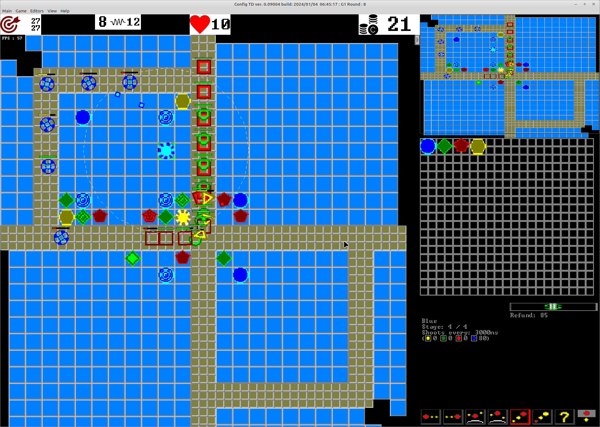
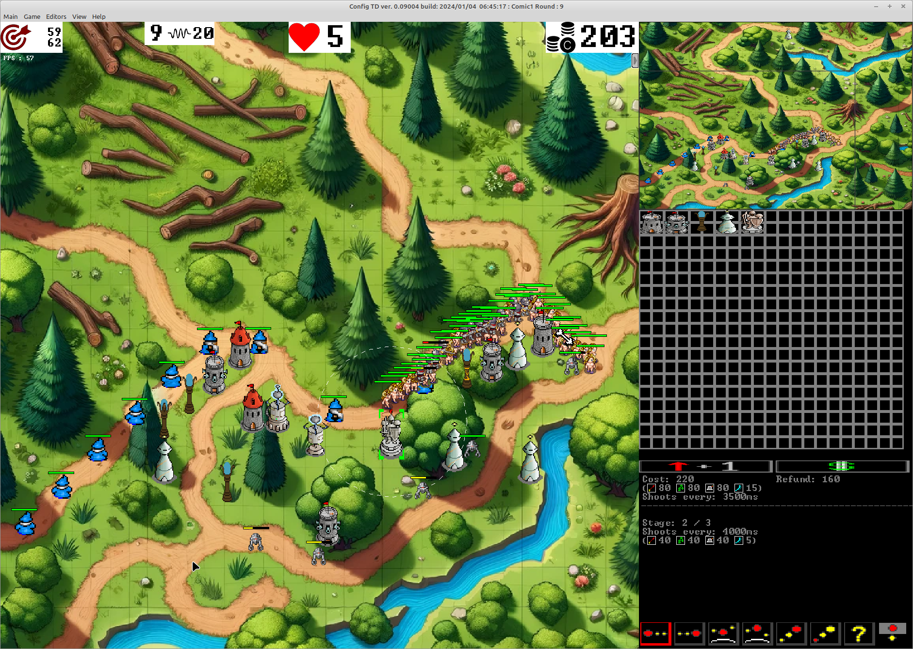

# Config Tower Defence (Config TD)

Config TD is a Opensource and free Tower Defence clone with the aim of maximal configurabillity and as easy as possible map creation for single and multiplayer matches.

It supports multiple graphical themes and is client server based.

#### Theme color

#### Theme comic

### Features
- 1 to 16 player (theoretically there is no limitiation to the player count, but in reallity the game does not support more than 65535 enemies at the map, which gives a upper limit for the playercount)
- client-server based (server runs in console mode, so dedicated server is possible)
- multiplatform Windows / Linux (matches can mix OS types)
- LAN and WAN playable (for WAN mode you need a port forwarding to the server)
- load / save of game, even in multiplayer mode (including automated bakups after each complete wave)
- pause / timespeedup x2, x4 
- ingame Chat
- game statistics (at the end of a match in detail, during the game only kills and money )
- hinting system (CTRL + left mouse button gives a "!" that everyone can see)
- 2 orthogonal gaming modes (Coop vs. Head to Head / Mazing vs. defeating) => 4 game variants
- 3 choosable difficulty levels
- 4 damage classes (typically labeled as Stich, Poison, Magic, Air)
- 2 kinds of opponent movements (Floor- / Air- units)
- all settings of the map / game can be edited at the same time by all player, there is no game leader. This allows multiple players to define the map and waves at the same time during gameplay
- the player can donate money between each others
- each unit / building / hero is complete free configurable, this also includes the availibility of buyable objects in the match
- multiple themes all free mixable, ingame map, texture, building, opponent and hero editor
- map creation during gaming (maps can be created wave by wave while playing them, even repeating of the last wave is possible)
  * map layer can be imported by image or created within the ingame editor
  * arbiture number of waves, with arbiture amount of opponents (max 65535 in per wave)
  * wave generator for automated wave creation
- arbiture opponent classes
  * boss (only tags)
  * bonus (does not decrease lifepoints when reaching the end of the track)
- arbiture amount of buildings, each building can have as many update levels as defined
  * bank (earn money on hit and destroy opponent)
  * siege vs. shooting (building can place bullets around its location or shoot at opponents)
  * slowing (dynamic or static)
  * splash (bullets can hit multiple opponents)
  * free choosable damage classes
  * supports multiple attack strategies
    o first / last / weakest / stronges / nearest / farest / random
    o prever air over floor / prever floor over air
- heros (more or less same as buildings, but can be moved free on the map)  

## What needs to be done to play the game

Read the [Manual](manual.md)

## What needs to be done to compile the game

### Contributors
Idea : Christian Wimmer, Uwe Schächterle 
Implementation : Uwe Schächterle 
Graphics : Uwe Schächterle, Dall e, Christian Wimmer 
Leveldesign : Christian Wimmer, Uwe Schächterle 
