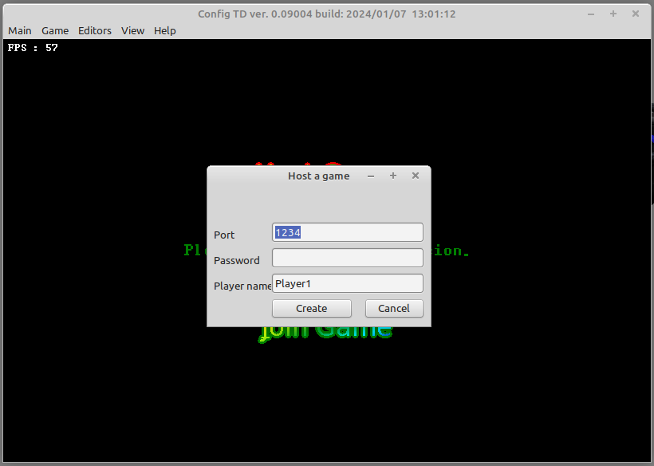
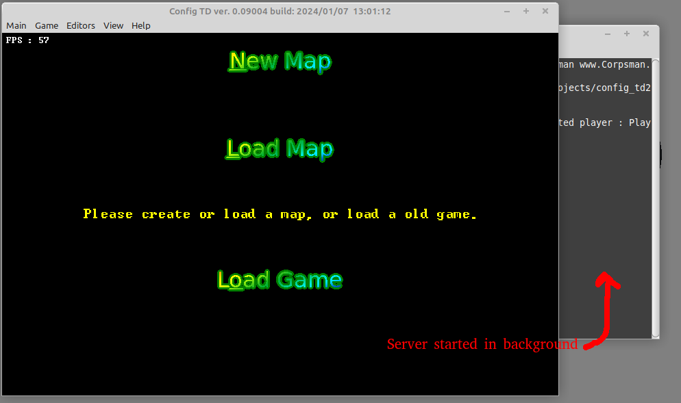
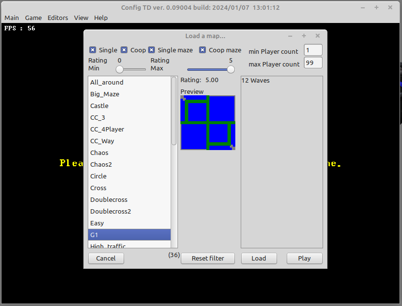
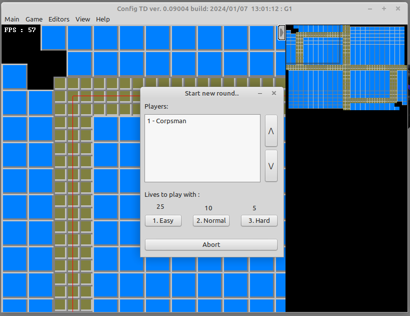
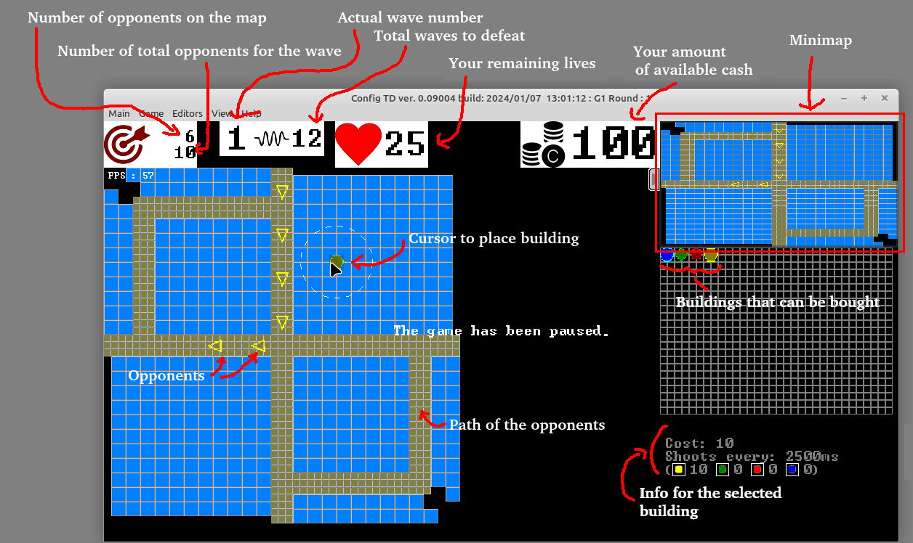

# Config Tower Defense (Config TD)

Config TD is a Opensource and free Tower Defense clone with the aim of maximal configurabillity and as easy as possible map creation for single and multiplayer matches.

It supports multiple graphical themes and is client server based.

#### Theme color

#### Theme comic

### Features
- 1 to 16 player (theoretically there is no limitiation to the player count, but in reallity the game does not support more than 65535 enemies at the map, which gives a upper limit for the playercount)
- client-server based (server runs in console mode, so dedicated server is possible)
- multiplatform Windows / Linux (matches can mix OS types)
- LAN and WAN playable (for WAN mode you need a port forwarding to the server)
- load / save of game, even in multiplayer mode (including automated bakups after each complete wave)
- pause / timespeedup x2, x4 
- ingame Chat
- game statistics (at the end of a match in detail, during the game only kills and money )
- hinting system (CTRL + left mouse button gives a "!" that everyone can see)
- 2 orthogonal gaming modes (Coop vs. Head to Head / Mazing vs. defeating) => 4 game variants
- 3 choosable difficulty levels
- 4 damage classes (typically labeled as Stich, Poison, Magic, Air)
- 2 kinds of opponent movements (Floor- / Air- units)
- all settings of the map / game can be edited at the same time by all player, there is no game leader. This allows multiple players to define the map and waves at the same time during gameplay
- the player can donate money between each others
- each unit / building / hero is complete free configurable, this also includes the availibility of buyable objects in the match
- multiple themes all free mixable, ingame map, texture, building, opponent and hero editor
- map creation during gaming (maps can be created wave by wave while playing them, even repeating of the last wave is possible)
  * map layer can be imported by image or created within the ingame editor
  * arbiture number of waves, with arbiture amount of opponents (max 65535 in per wave)
  * wave generator for automated wave creation
- arbiture opponent classes
  * boss (only tags)
  * bonus (does not decrease lifepoints when reaching the end of the track)
- arbiture amount of buildings, each building can have as many update levels as defined
  * bank (earn money on hit and destroy opponent)
  * siege vs. shooting (building can place bullets around its location or shoot at opponents)
  * slowing (dynamic or static)
  * splash (bullets can hit multiple opponents)
  * free choosable damage classes
  * supports multiple attack strategies
    o first / last / weakest / stronges / nearest / farest / random
    o prever air over floor / prever floor over air
- heros (more or less same as buildings, but can be moved free on the map)  

## What needs to be done to play the game

Read carefully the [manual](manual.md) or

1. Clone or download this repository to your harddrive
2. Start the "config_td" client supposed for your operating system (Linux 64 or Win64 are supported by default, for other OS you need to compile the source by yourself) 
3. Click "Host Game" if you are the first player and do not use a dedicated server, otherwise click "Join Game" 
4. Fill in your Player name and click on "Create" 
5. Select "Load Map" 
6. Select the G1 map (side note: every map that has a description is "defined" and playable, all the other maps are in "development" state) and hit "Play" (Attention, if you want to play with multiple players, only hit load and wait until all players connected to the game) 
7. Select the difficulty you want to play the map. 
8. Hit "P" to pause the game and take a look what the map offers you and how to play. The "G1" map is a defeating map, so you do not need to maze here, place all the buildings you buy onto the blue area and enjoy the game. Can you defeat all 12 waves in hard mode ?

## What needs to be done to compile the game

To be able to compile the code you need the [Lazarus-IDE](https://www.lazarus-ide.org)

Inside Lazarus you need to install the following packages:
- L-Net from [here](https://github.com/almindor/lnet) or use the online Packagemanager to install
- LazOpenGLContext (comes with lazarus, install via "Package" -> "Install Packages")
- TaChartLazarusPkg (comes with lazarus, install via "Package" -> "Install Packages")

Additional you need to download:
- [DGLOpenGL](https://github.com/saschawillems/dglopengl)

### Contributors
Idea : Christian Wimmer, Uwe Schächterle 
Implementation : Uwe Schächterle 
Graphics : Christian Wimmer, Dall e, Uwe Schächterle 
Leveldesign : Christian Wimmer, Uwe Schächterle 
