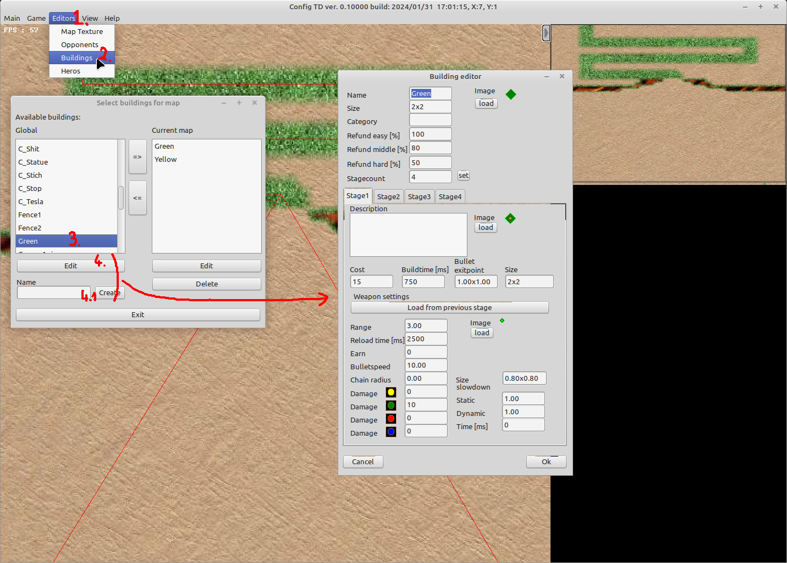
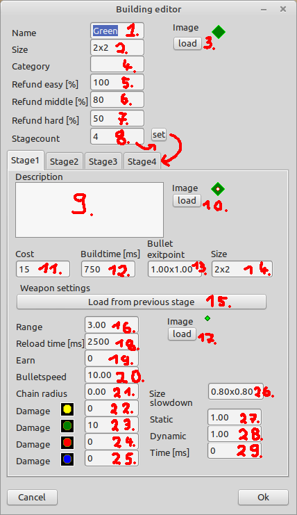

# Building guide

This guide explains in detail how to create a new building

Always a good start is to look at a existing building, that is already known. To do so

1. Open Building editor   
  (1) click editors  
  (2) Buildings
  (3) select a global building (on the left side)  
  (4) click edit (on the left side)  
  (4.1) if you enter a new name and click Create you get the same screen with empty values to edit your newly created building

2. When openend you have the following settings to adjust 

| Name | Description | 
| -- | -- |
| (1) Name | Name that is shown in the info box during the game
| (2) Size | Normalized size in grid (the image will be scaled to the given values), this is the size that will be blocked on the map after the building is placed (it can be smaler as the stage sizes)
| (3) Image |  Image / Animation used, supported are (.bmp, .png, .ani), this is the image only for the buy menu
| (4) Category | This field is not used by the game in the moment
| (5) Refund easy [%] | If you sell the building during the game, this is the factor which the invest will be multiplied with before being refunded
| (6) Refund middle [%] | If you sell the building during the game, this is the factor which the invest will be multiplied with before being refunded
| (7) Refund hard [%] | If you sell the building during the game, this is the factor which the invest will be multiplied with before being refunded
| (8) Stagecount | defines the number of stages to which the building can be leveled up

The following settings are per stage. In prinzipal a building can have as many stages as someone defines but need to have at least one stage (even if the building is used to maze and does not attack at all [see fence building])

| Name | Description | 
| -- | -- |
| (9) Description | Optional further details 
| (10) Image | Image / Animation used, supported are (.bmp, .png, .ani), this is the image that is shown on the map during gameplay
| (11) Cost | Prize you have to afford to buy the building (if stage 1) or to upgrade to this stage
| (12) Buildtime [ms] | Time in milli seconds to level up, or build the building
| (13) Bullet exitpoint | Coordinates of the bullet exit point in grid coordinates, relative from the buttom left corner of the image (you can set this by clicking onto the image, or by typing it in manually)
| (14) Size | Size in Grid coordinates shown on the map, if this is grater than the size (2), than the image will grow towards the top and "hide" the maps content behind

Each stage defines its own weapon settings
| Name | Description | 
| -- | -- |
| (15) Load from previous stage | This buttons loads all weapon settings from previous stage into the fields
| (16) Range | This is the range in grid coordinates if range is > 0 then the building acutally "shoots" at the opponents. if range is < 0 the bullets will be "placed" on every reload time somewhere whithin this range on the floor
| (17) Image | Image / Animation used, supported are (.bmp, .png, .ani), this is the image for the bullet that is beeing shoot at the opponents or layed onto the map
| (18) Reload time [ms]| time in ms until the building is ready to shoot out the next weapon (if a opponent is in range)
| (19) Earn | if > 0 then the owner earns money if the bullet hits the opponent even it the bullet does not destroy it
| (20) Bulletspeed | speed in grid coords per second of the bullet
| (21) Chain radius | if > 0 the bullet can hit multiple opponents if there is "damage" left after the actual hit. If a other opponent is within the chain radius the bullet will set this opponent as its new target
| (22) Damage | Strength in the first power class
| (23) Damage | Strength in the second power class
| (24) Damage | Strength in the third power class
| (25) Damage | Strength in the fourth power class
| (26) Size | Size of the bullet in grid coordinates
| (27) slowdown static | Multiplier to the speed of the opponent that applies permanently, different buildings can chain these multipliers to one opponent
| (28) slowdown dynamic | Multiplier to the speed of the opponent that applies for a given time, different buildings can chain these multipliers to one opponent
| (29) Time [ms] | time in milli seconds how long the slowdown dynamic value will be applied to the opponent

