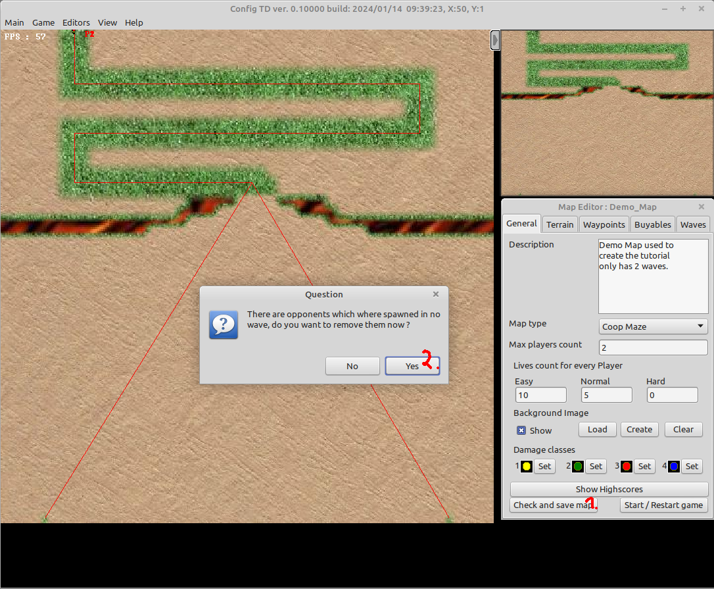
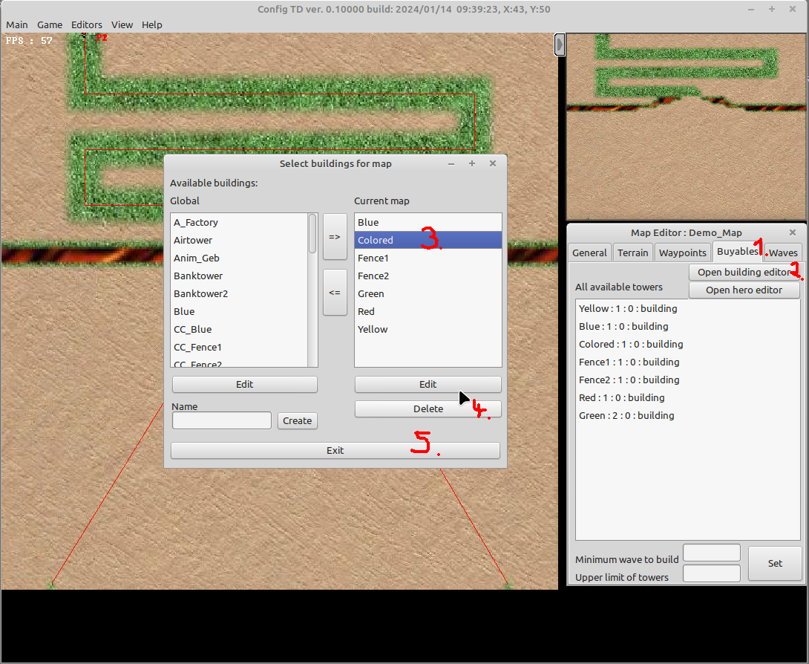
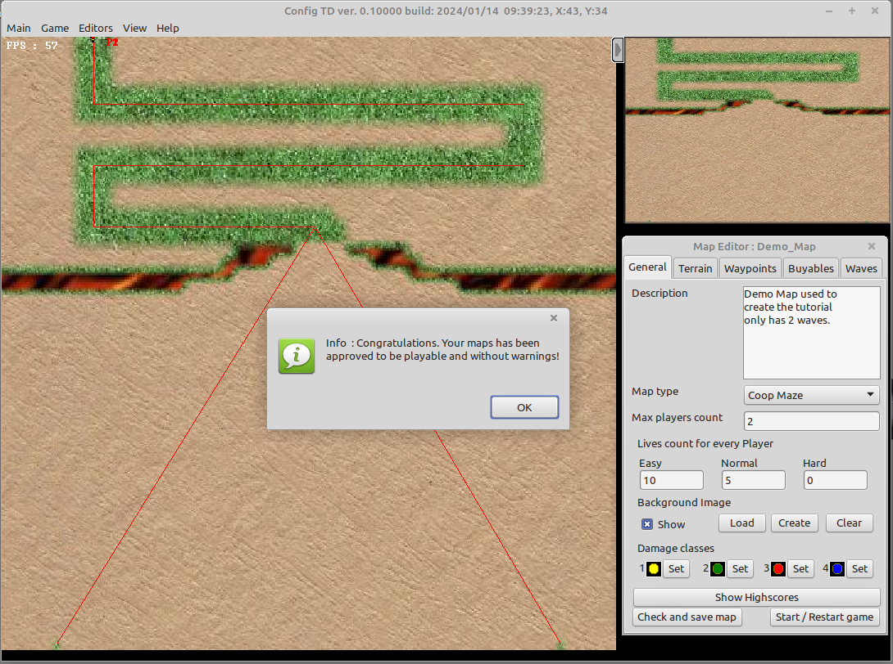

# Clean and check map

This guides help you cleaning up the map after you finished wave creation.

In order to share the map with other players its higly recommended to clean up the map from all files that not needed anymore (This could decrease the map size by a lot). During the [waveguide](waveguide.md) all possible buildings / heros and opponents where added to the map, but are they really used ?

1. Removing unused opponents   
 (1) click check and save map  
 (2) click yes, every unused opponent is now removed from them map.

2. Removing unused buildings / heros is not possible to be automated, so you need to remove all unused buildings / heros by hand   
 (1) open the Buyables tab  
 (2) open the building editor  
 (3) select the buildings you want to remove  
 (4) remove the building and repeat step (3), (4) for each building that needs to be removed  
 (5) close editor

3. Finally check, if you not deleted to much, by again hitting the "Check and save map" button 

If you see the message as shown above, you made it. Happy playing.