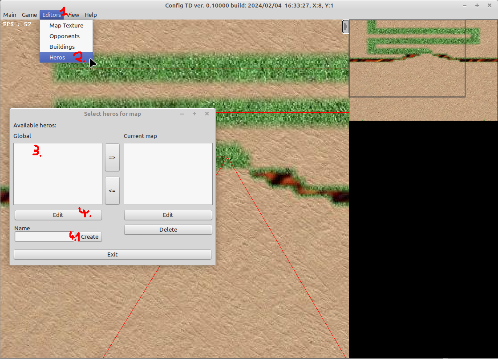
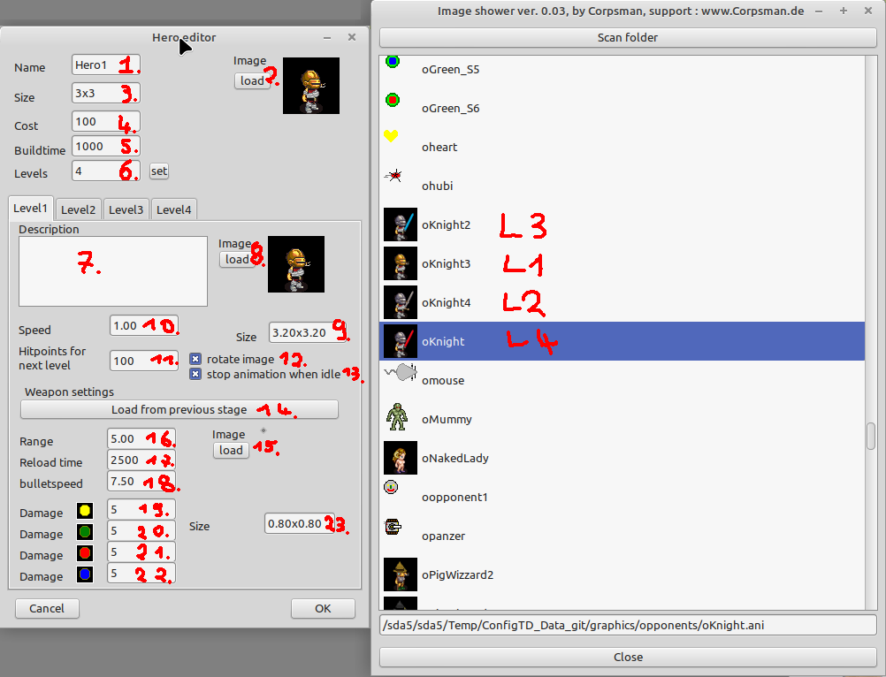

# Hero guide

This guide explains in detail how to create a new hero. In short, a hero is a building that can move. Instead of leveling up by money the hero levels up by "hitpoints".

1. Open hero editor    
  (1) click editors  
  (2) Heros
  (3) select a global hero (on the left side)  
  (4) click edit (on the left side)  
  (4.1) if you enter a new name and click Create you get the same screen with empty values to edit your newly created hero

2. When openend you have the following settings to adjust 

| Name | Description | 
| -- | -- |
| (1) Name | Name that is shown in the info box during the game
| (2) Image |  Image / Animation used, supported are (.bmp, .png, .ani), this is the image only for the buy menu
| (3) Size | Normalized size in grid (the image will be scaled to the given values), this is the size that will be blocked on the map after the building is placed (it can be smaler as the stage sizes)
| (4) Const | initial cost to by the hero
| (5) Buildtime | initial build time to build the hero
| (6) Levels | Number of levels the hero can "grow"

The following settings are per level. In prinzipal a hero can have as many levels as someone defines but need to have at least one level.

| Name | Description | 
| -- | -- |
| (7) Description | Optional further details for each level
| (8) Image | Image per stage (use image shower to find good matchings (L1 ..L4)), supported are (.bmp, .png, .ani)
| (9) Size | adjust size as needed
| (10) Speed |  in grids per second
| (11) Hitpoints for next level | the minimum amount of hitpoints needed to level up (typically this value should increase exponentially from level to level)
| (12) rotate image| rotate image (disabled if using a .ani file)
| (13) stop animation when idle | if a .ani file is used, the animation can be stopped if hero is not moving
| (14) Load from previous stage| This buttons loads all weapon settings from previous level into the fields
| (15) Image | defines the weapons image, supported are (.bmp, .png, .ani)
| (16) Range | This is the range in grid coordinates 
| (17) Reload time [ms] | time in ms until the building is ready to shoot out the next weapon (if a opponent is in range)
| (18) bulletspeed | speed in grid coords per second of the bullet
| (19) Damage | Strength in the first power class
| (20) Damage | Strength in the second power class
| (21) Damage | Strength in the third power class
| (22) Damage | Strength in the fourth power class
| (23) Size | Size of the bullet in grid coordinates
