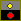

# In game

This guide tries to give you a overview of the different in game elements

## Buildings strategy buttons
| Image | Description |
| --- | :--- |
|  |  Attack first opponent first
|  | Attack last opponent first
|  | Attack nearest opponent first
|  | Attack farest opponent first
|  | Attack strongest opponent first
|  | Attack weakest opponent first
|  | Attack Random opponent
|  | prefer air units over floor units
|  | prefer floor units over air units