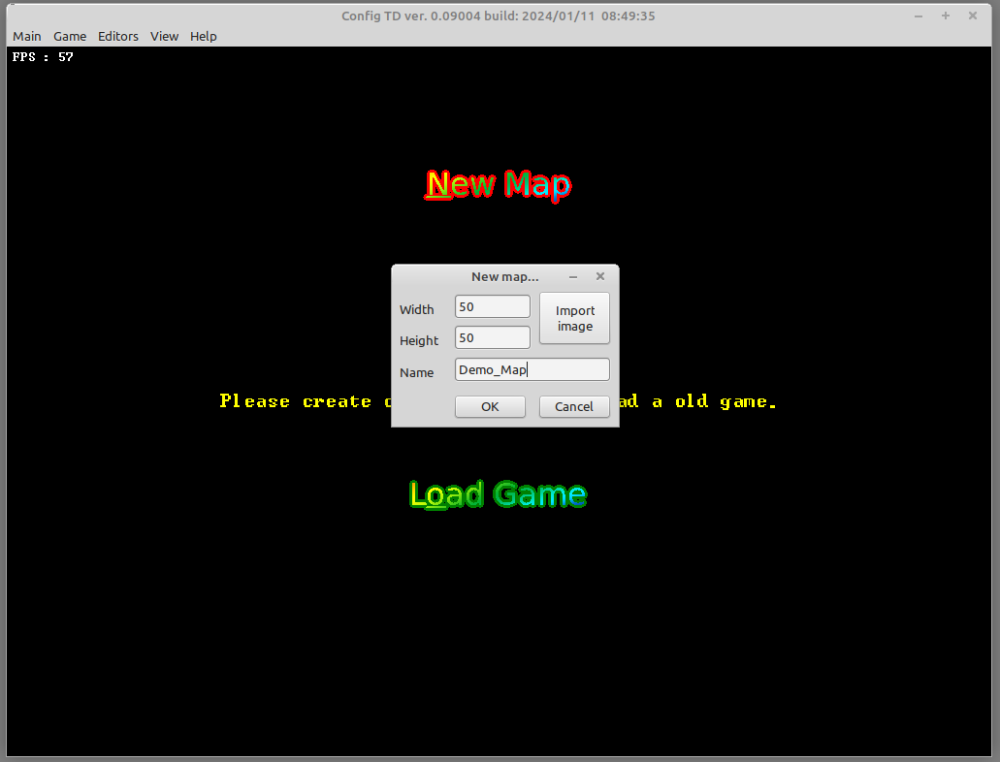
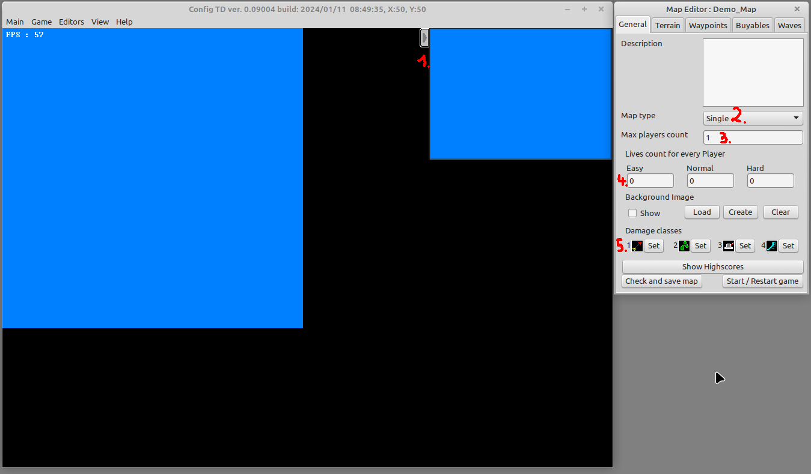
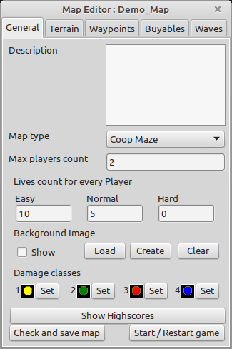
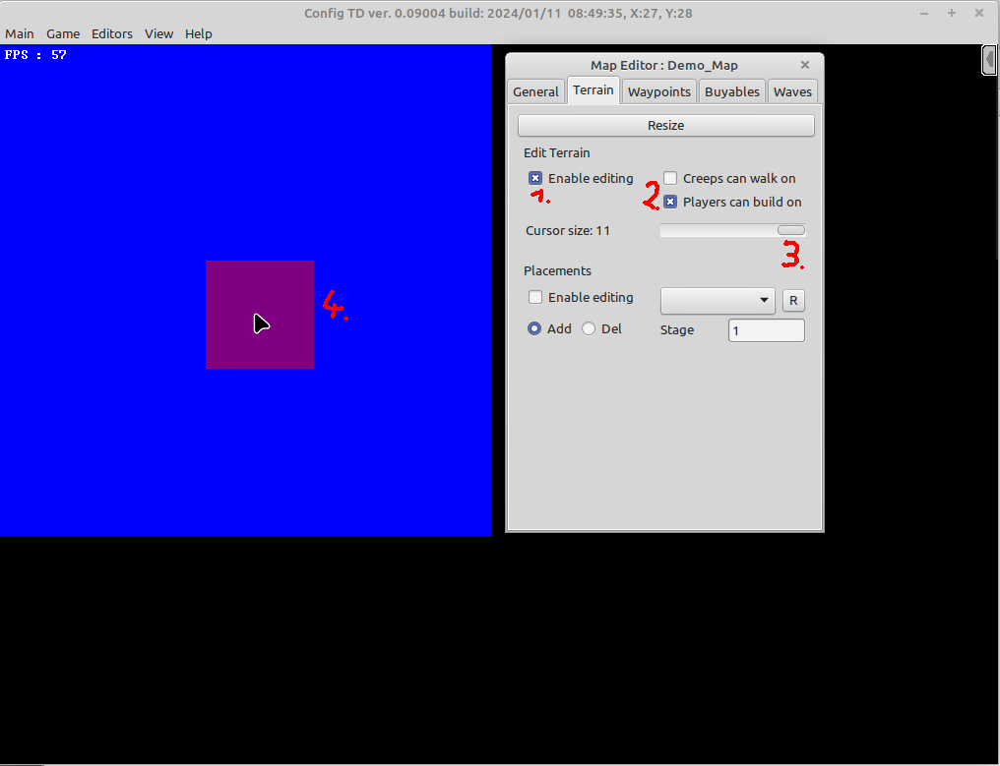
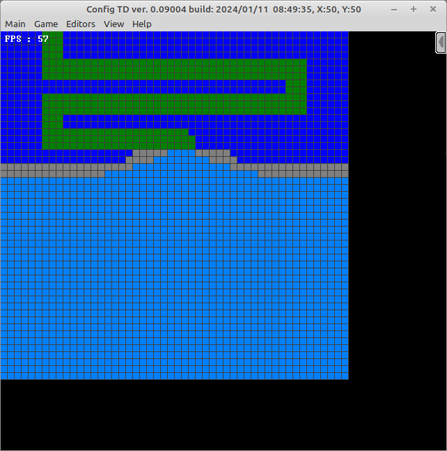
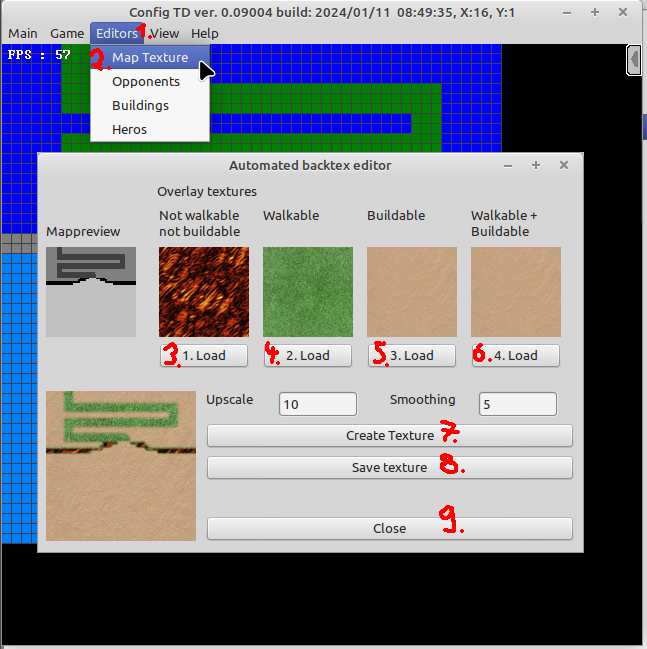
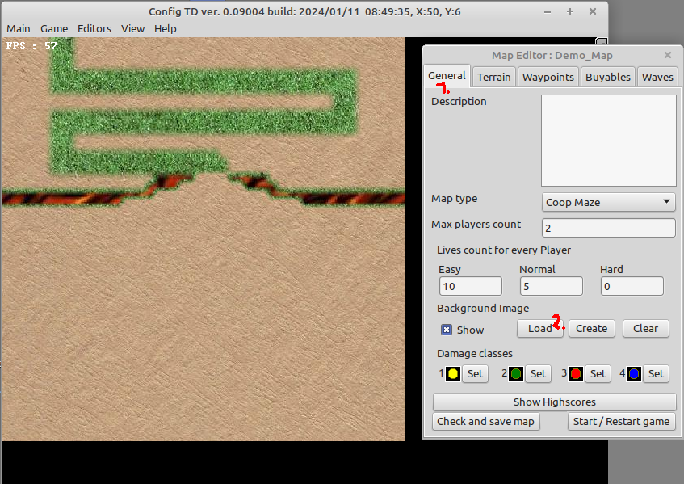
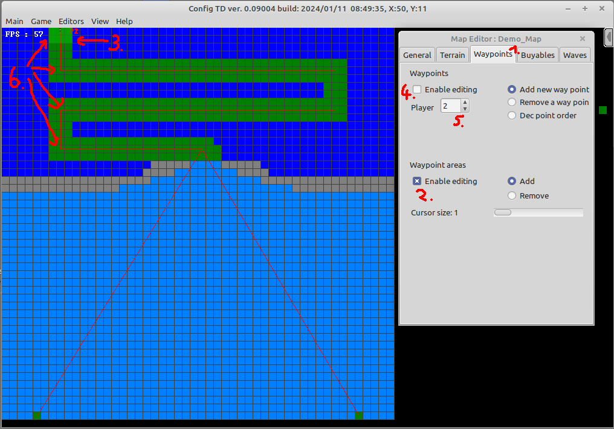

# Mapguide

In this instruction you learn everything needed to create a new map and its first wave to be able to play.

## Creating the map, textures and waypoints ..

1. Start and host a local game. If you are not shure how to do this read the [quickstart](quickstart.md) guide
2. Hit the "New Map" button and enter the size and name of the map you want to create (the size can be changed later, the name not) 
3. Click OK and the game opens your newly created map in the map editor mode 
First we do some quick adjustments:
* (1) hide the minimap and preview area, we do not need this in editor mode (click on the small arrow and it disapears)
* (2) choose the kind of map we want to create:
  
 | Map type | description |
 | --- | --- |
 | Single | Stands for each players plays with his own lifepoints, who ever player looses all its lifepoints loose, the last player with lifepoints is the winner
 | Coop | Stands for cooperation mode, all player share their lifepoints and play as a team to beat all waves. Its all loose or all win against the map designer
 
The additional "Maze" option wich extends the map types is just for information porpuse, to give the player a hint if the map is either a defeat map or a map where you build the mazes by "clever" place your buildings during construction. 
=> choose "coop maze" for this demo map

* (3) define the maximum number of players supported by the map 
=> choose "2" for this demo map
  
* (4) define the available lifepoints per difficulty level, choosing 0 disables this level of difficulty for the map  
=> choose "10" for easy and "5" for normal

* (5) as we want to create a colored map we change the default damage class icons with the corresponding versions for colored maps. To do so click on each "set" button and choose the right image from the folder "graphics/damage_classes/colored"

When finished the editor sould look like this:  

4. Next change the complete maps terrain to not walkable but buildable 
* (1) enable terrain editing
* (2) check the "Players can build on" box
* (3) make the mouse cursor as big as possible
* (4) paint the whole map into dark blue

There are 4 possible map colors which results by the combination of the 2 checkboxes.

| Color | Description | 
| --- | --- |
| gray | no buildings can be placed on, no creep walking allowed
| green | no buildings can be placed on, creeps can walk on
| bright blue | buildings can be placed on, creeps can walk on
| dark blue | buildings can be placed on, no creep walking allowed

! Attention !  
Opponents that can fly, don't care the not walking thing, the fly over it.

5. For this demo map we want to mix maze and defeat mode for maximum demonstrations. So click and adjust the map with what you just learned until it looks like this (hint: you can enable a grid if you want "View" -> "Show/hide grid")

6. Next we make the background image of the map, so that it looks a little bit more eycatching 
* (1)(2) Select "Editors" -> "Map Texture" to open the map textrure tool
* (3)-(6) Select some nice textures from the "graphics/textures" folder for each type of floor
* (7) hit the "Create Texture" button to create a preview
* (8) save the resulting image into your map folder "maps/Demo_Map/" as background.jpg
* (9) close the dialog.

7. Now add the created image as background to your map by 
* (1) switching back to general tap
* (2) loading the image

8. Creeps need paths to follow 

There are 2 ways to let creeps walk their path on the map, both ways need waypoints defined.
* (1) switch to "Waypoints" tab and
* (2) [Optional] check the "Enable editing" box on the Waypoint area
* (3) [Optional] paint the starting area (bright green area) 
Normally all opponents are spawned at one single point (the first point of a waypath). To get a little bit better "distribution" you can define waypoint areas, for the creep the whole area is the same as the waypoint which is located onto it. This is a optional feature and more related to expirienced users.
* (4) check the "Enable editing" box on the Wayponts area
* (5) Choose the player you want to define waypoints for
* (6) Click multiple times on the map. Each click sets a next waypoint, which the creeps have to reach. Creeps spawn on the very first point and if they reach the last one, you or your team lose one live. In this example the waypoints for both player is in the top the same and in the mazing area the waypaths differ (player 1 to the left and player 2 to the right).

To get the best gaming experience its recommended to always use blocks as waypoints where the player is not allowed to place buildings on, so repeat the steps from 5. and 6. to define the landing spot of the lasts waypoint as "not buildable"

If you managed to do everything right, your map should look the same as above. Take a cup of coffee and relax, the most complicated parts are done :).

next comes the [waveguide](waveguide.md)