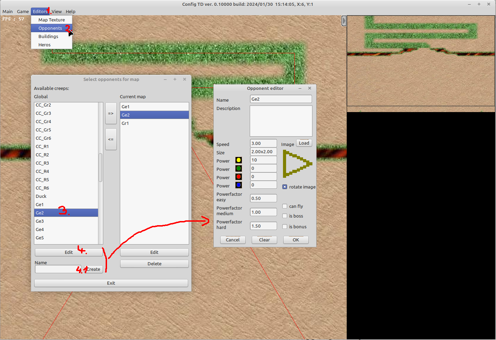
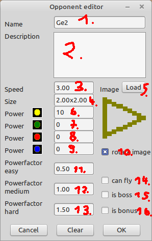

# Opponent guide

This guide explains in detail how to create a new opponent.

First take a look at a existing opponent, this can be done by:

1. Open Opponent editor   
  (1) click editors  
  (2) Opponents  
  (3) select a global opponent (on the left side)  
  (4) click edit (on the left side)  
  (4.1) if you enter a new name and click Create you get the same screen with empty values to edit your newly created opponent

2. When opened you have the following settings to adjust  

| Name | Description | 
| -- | -- |
| (1) Name | Name that is shown in the info box during the game
| (2) Description | Optional further details 
| (3) Speed | Normalized speed in grid per second
| (4) Size | Normalized size in grid (the image will be scaled to the given values)
| (5) Image |  Image / Animation used, supported are (.bmp, .png, .ani)
| (6) Power | Strength in the first power class
| (7) Power | Strength in the second power class
| (8) Power | Strength in the third power class
| (9) Power | Strength in the fourth power class
| (10) rotate image | if source is .bmp or .png image rotation can be enabled or disabled
| (11) powerfactor easy | all power class values will be multiplied with this value if game is running in easy mode
| (12) powerfactor medium | all power class values will be multiplied with this value if game is running in medium mode
| (13) powerfactor hard | all power class values will be multiplied with this value if game is running in hard mode
| (14) can fly | if set, the unit moves straight from waypoint to waypoint (does not care about mazing)
| (15) is boss | this is a label, and can be quereed by the chat, does not influence any game dynamics
| (16) is bonus | if unit reached the last waypoint the player will not loose a lifepoint
