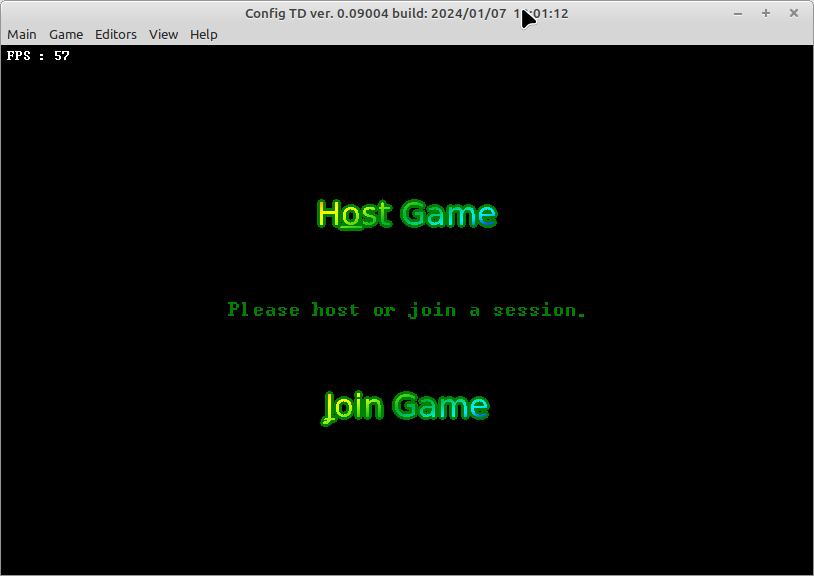
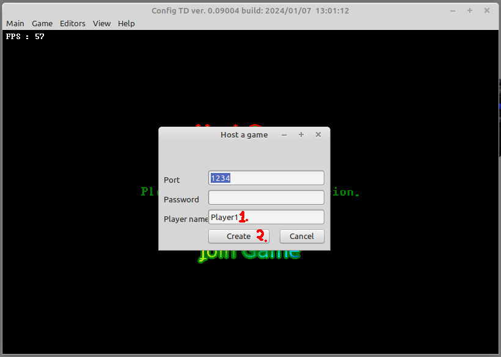
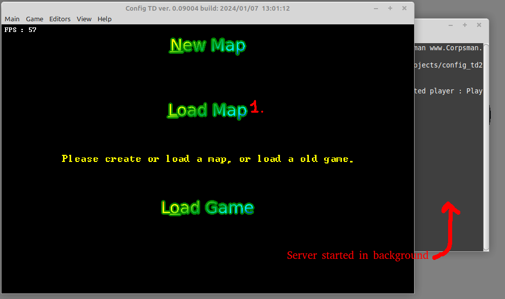
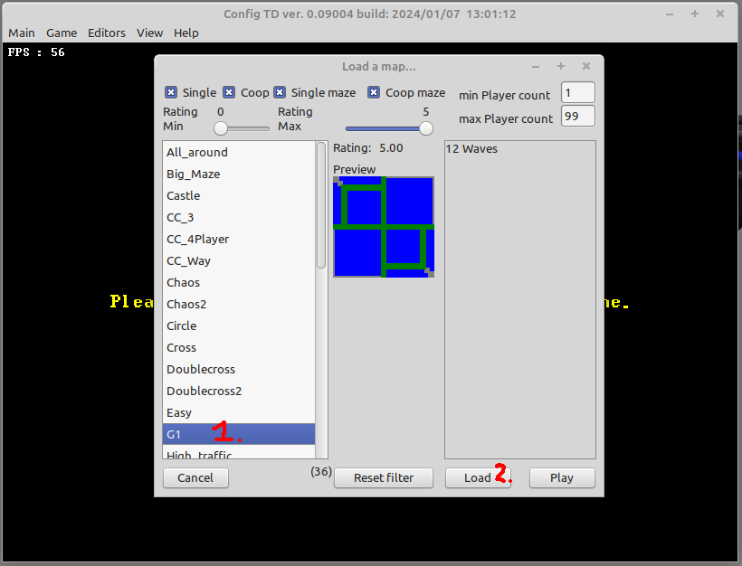
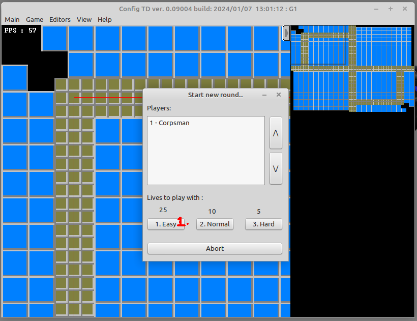
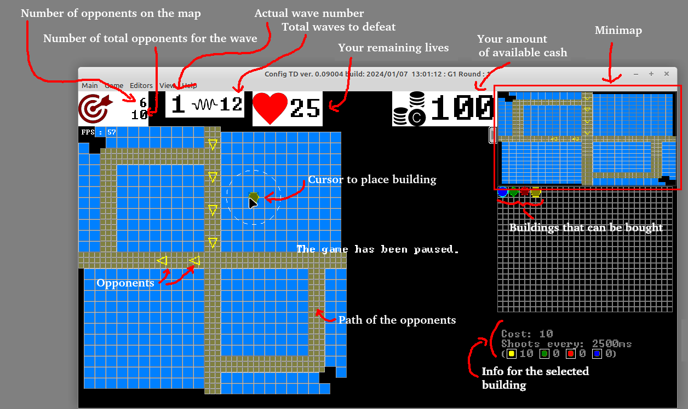

# Quickstart

In this guide you get all information needed to start and host a game and play the first wave.

1. Start the "config_td" client supposed for your operating system (Linux 64 or Win64 are supported by default, for other OS you need to compile the source by yourself) (On Linux it could be needed to chmod client and ctd_server application with x flag to be able to execute). 
2. Click "Host Game" if you are the first player and do not use a dedicated server, otherwise click "Join Game" 
3. Fill in your Player name and click on "Create" 
4. Select "Load Map" 
5. Select the G1 map (side note: every map thats description is "not empty" is playable, all the other maps are in "development" state) and hit "Play" (Attention, if you want to play with multiple players, only hit load and wait until all players connected to the game) 
6. Select the difficulty you want to play the map. 
7. Hit "P" to pause the game and take a look what the map offers you and how to play. The "G1" map is a defeating map, so you do not need to maze here, place all the buildings you buy onto the blue area and enjoy the game. Can you defeat all 12 waves in hard mode ?