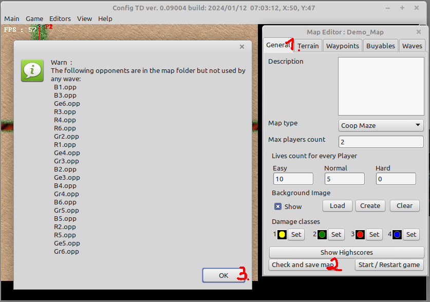
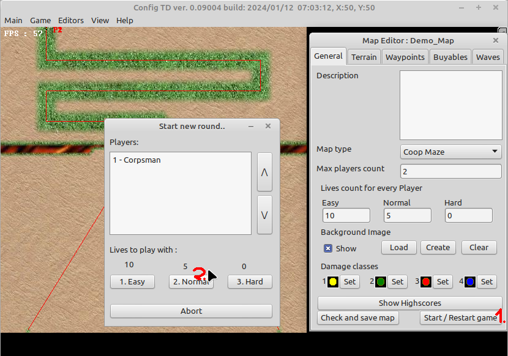
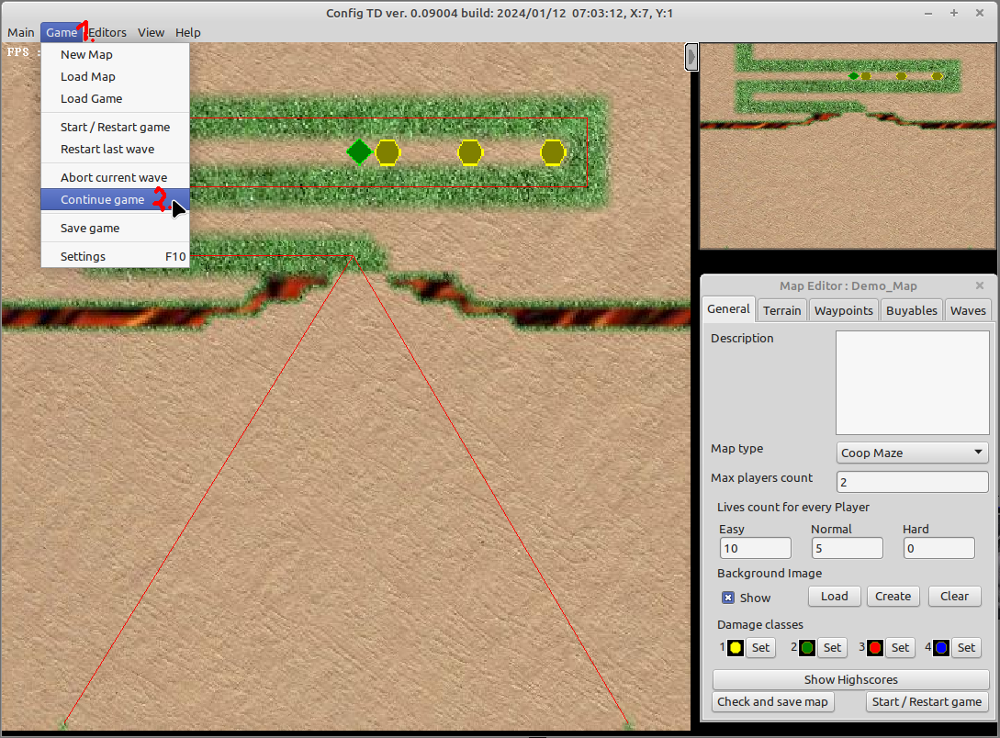
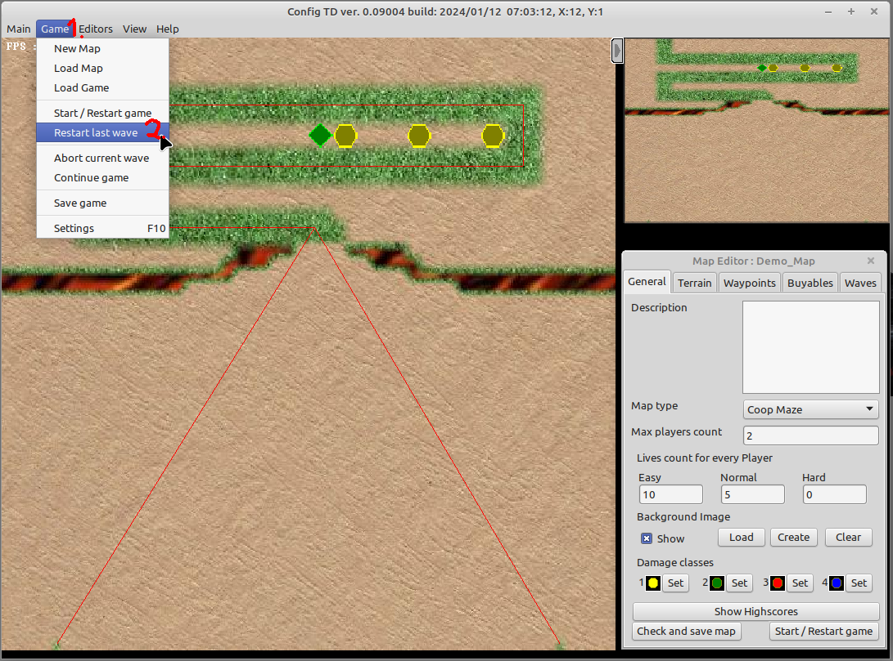

# Validate map

This guide shows how to validate a map wave by wave and proof that it is playable (balanced right).

First you need to define waves (see [waveguide](waveguide.md) on how to do that).

1. check if the map contains any errors 
* (1) switch to "General" tab
* (2) hit the "Check and save map" button
* (3) if you just did the waveguide with its first wave, then you see a result like in the picture above. To play and test the map you can ignore warnings, only errors you need to take care of.

2. In this case everything is fine we can continue by actually playing the wave. 

Wait until all players who also want to test are connected, then  

* If you start from scratch and want to start testing with the First wave 
  * (1) Switch to "General" tab if not there already and hit "Start / Restart game"
  * (2) Select the difficulty for which you want to test. Its absolutly recommended to test / validate and play the map on "Normal" or "Hard" settings. If you validate the map using "Easy" the map could be to hard to play for other players.
* If you won the last wave, have defined a new wave and now want to test the next defined wave 
  * (1), (2) hit "Game" -> "Continue game" and the game proceeds like the new wave was always there
* If you lost the wave, adjust the wave settings to what ever you think would make the wave winable (see [waveguide](waveguide.md)) 
  * (1), (2) hit "Game" -> "Restart last wave" and restart the last played wave (the game will automatically restore the game progress like it was before playing the last wave)

Thats it, happy wave defining.  
Remember, if you are finished with wave adding, do the [clean and check](clean_and_check_map.md) guide.