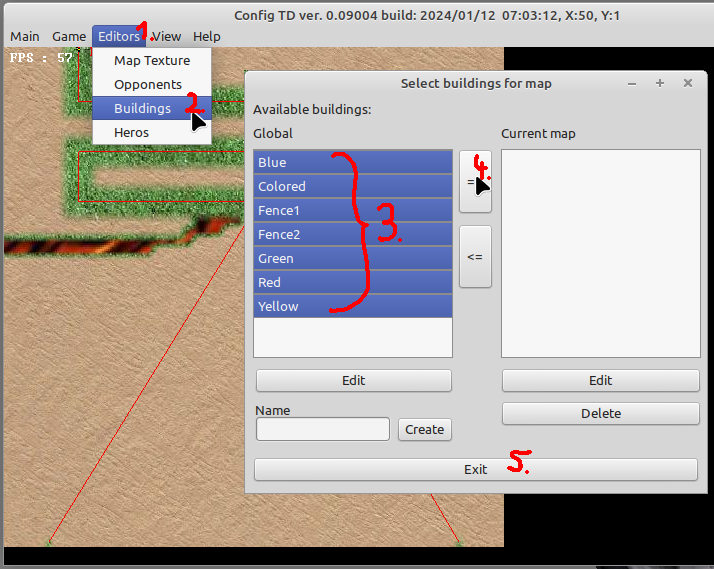
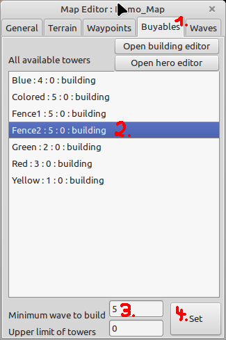
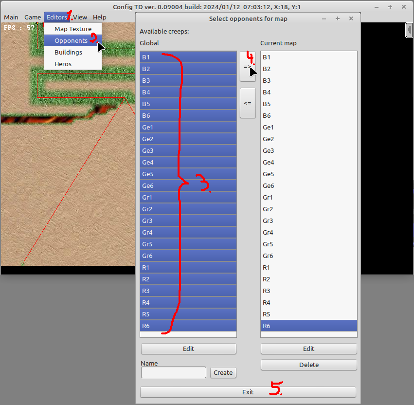
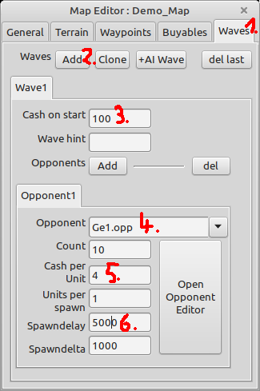
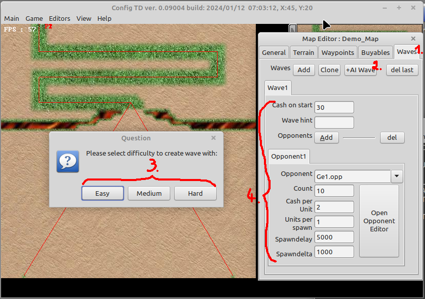

# Waveguide

This instructions show how to populate the map with buyable buildings, and waves to play.

To be able to actually play the map you need to meet 2 conditions:

* have buildings that can be bought
* define waves that send out creeps

## Defining buyable buildings

1. You need to add buildings to the map 
* (1), (2) open the building editor
* (3) on the left side are the "global" accessable buildings on the right side the buildings on the map. Select all global buildings
* (4) add them to the map and
* (5) close the editor 
2. Next we define the waves up when the buildings should be buyable.  
The idea is as follows: first introduce each new wave one building per damage class, as last (wave 5) enable all buildings needed for mazing. 
* (1) switch to "Buyables"
* (2) select a building
* (3) define the minimum wave (seting "upper limit of towers" to 0 removes the limit, otherwise it is only allowed to buy the given amount of towers, this can be usefull with e.g. "Banks" or "Heros")
* (4) set the values and repeat until all buildings are set like in the image above

Defining the minimum wave for a building to by has two effects:
* by reducing the buildings to buy the player knows better which building to buy (at least at the very first waves this makes sense)
* the ai wave generation algorithm takes also care of these values, which improves the quality of generated waves

## Defining a wave that send creeps

1. add all creeps to the map 
* (1), (2) open the opponent editor
* (3) select all color sheme opponents and 
* (4) add them to the map
* (5) close the editor

There are 2 way's of defining a new wave:
* Manually
* by using the "+AI Wave" button

2. define a new wave (by hand)  
* (1) switch to "Waves" tab
* (2) click "Add" to manually add a new wave to the map
* (3) as this is the very first wave give the player some money to buy towes
* (4) select a opponent (see [balancing](../balancing.ods) table or opponent overview for opponent properties)
* (5) increase the amount of money per opponent kill by a bit
* (6) set spawndelay to 6s this gives the player enough time to place his first buildings before the map is populated with opponents

3. define a new wave (using the "+AI Wave" button) 
* (1) switch to "Waves" tab
* (2) click "+AI Waves" button
* (3) select the difficulty level you are aiming for
* (4) check results and tweak them if needed

Thats it, you now have set everything to actually play the map. Continue with the [validate map]() guide to see how you can play and validate the map during wave generation. 

Finally do the [check and clean map]() guide to cleanup your map when finished. 